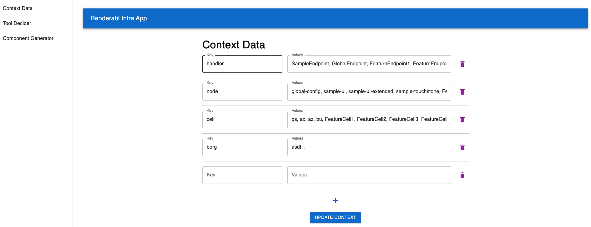

# renderabl
prototype

# sampleApp

sampleApp is a sample chatbot that takes in prompts and responds with UI cards. This would normally be an example of a client company which has an app that takes in text prompts, and want UI golf cards to trigger as a response. I just happend to create a sample app so that I can pretend to be the client, and have a better understanding of what part of the workflows I can automate with Renderabl FE and BE.

# infraWebApp
This is a web app for developers to help interact with the Renderabl backend. It's purpose is to allow developers to generate new function call tools, new UI components, and new context KV-entries. This data will all be ingested by the backend when the developer's app when they take in prompts and pass it to the backend, which appropriately determines which developer-provided function to call, and which arguments it should take in.

# Development steps
## Rebuild after changes
use the `tsc --build` command (Command + Shift + b with VSCode) to rebuild .ts to .js files in tsconfig.json

For targets in the sampleApp, run command for src/sampleApp/tsconfig.json
For the infraWebApp, run command for `src/infraWebApp/tsconfig.json`

then, do: `npx webpack` (from the root component), then start Live Server on HTML

For any styling changes on the sampleApp, run `npx tailwindcss -i ./src/sampleApp/app.css -o ./src/sampleApp/output.css`

infraWebApp uses materials UI, not tailwind, so this step is not necessary.

## Build sampleApp or infraWebApp
navigate to their respective directories where index.html is located, then run `live-server`

Alternatively, I use the VSCode extension "Live Server" so that it's a click away.

# Start servers
## Start Redis server (before starting backend server)
First, start the Redis DB server with `redis-server`, then for the infraWebApp start the backend server with `node ./dist/renderableBe/backend.js`. For the sampleApp, start `node ./dist/sampleApp/backend.js`

# Directory breakdown
`src/sampleApp/generalcards` contains .tsx UI cards that I was experimenting with before I narrowed down to the golf vertical for the MVP.

`src/sampleApp/golfcards` contains .tsx UI cards that I've created. golfballcard.tsx was generated via a call to generateComponent in backend.ts, and golfplayercard.tsx and golftournamentcard.tsx were created manually.

`/src/renderableBe` contains backend.ts, which contains both the backend for the app.tsx I created, as well as backend functions that would live in the Renderabl service. I did this out of ease of just starting up one local server for development. fakedb.ts is where I put KV pairs that I would normally put in a DB.

`/src/renderableFe` contains renderableFeUtils.ts, which contains helper logic that builds out the functionality of Renderable FE by automating card generation and mutations (eventually).

`/src/types.ts` contains all the types and props.

# API
## Example api/generateComponent request
{
    "agentName": "GolfBallAgent",
    "agentProps": "picture_url: string, name: string, summary:string, launch_characteristics:string, spin_characteristics: string, year_introduced:number, firmness:string, players_who_used:string[]",
    "agentDescription": "A chat agent designed to show UI card components about various golf balls. Call whenever you need to respond to a prompt that asks about a golf ball. The input parameters should be the golf ball name"
}

## Example api/writeToolNode request
{
    "agentName": "TraficAgent",
    "agentArgs": {"$schema":"http://json-schema.org/draft-07/schema#","type":"object","properties":{"handler":{"type":"string"}, "cell":{"type":"string"}}, "required":["handler"], "additionalProperties": false},
    "agentDescription": "An agent designed to show UI card components of monitoring traffic data of a specific endpoint. Call whenever you need to respond to a prompt that asks traffic data given some parameters"
}

You can use Postman, but the infraWebApp also provides a UI wrapper that will call the API.

## Example api/getFunctionCall request
{
    "prompt": "Tiger Woods 2008"
}

## Getters
http://localhost:5500/api/getToolGraph
http://localhost:5500/api/getContext

## Example api/provideContext
http://localhost:5500/api/provideContext

{
  "handler": [
    "SampleEndpoint",
    "GlobalEndpoint",
    "FeatureEndpoint1",
    "FeatureEndpoint2",
    "FeatureEndpoint3",
    "FeatureEndpoint4",
    "FeatureEndpoint5",
    "FeatureEndpoint6",
    "FeatureEndpoint7",
    "FeatureEndpoint8",
    "FeatureEndpoint9",
    "FeatureEndpoint10"
  ],
  "node": [
    "global-config",
    "sample-ui",
    "sample-ui-extended",
    "sample-touchstone",
    "FeatureNode1",
    "FeatureNode2",
    "FeatureNode3",
    "FeatureNode4",
    "FeatureNode5",
    "FeatureNode6",
    "FeatureNode7",
    "FeatureNode8",
    "FeatureNode9",
    "FeatureNode10"
  ],
  "cell": [
    "qs",
    "ax",
    "az",
    "bu",
    "FeatureCell1",
    "FeatureCell2",
    "FeatureCell3",
    "FeatureCell4",
    "FeatureCell5",
    "FeatureCell6",
    "FeatureCell7",
    "FeatureCell8",
    "FeatureCell9",
    "FeatureCell10"
  ],
  "component": [
    "feature1",
    "feature2",
    "FeatureComponent1",
    "FeatureComponent2",
    "FeatureComponent3",
    "FeatureComponent4",
    "FeatureComponent5",
    "FeatureComponent6",
    "FeatureComponent7",
    "FeatureComponent8",
    "FeatureComponent9",
    "FeatureComponent10"
  ]
}

# Prisma + SQL
If a model is changed in schema.prisma, rerun these two commands:

`npx prisma migrate dev --name init` and `npx prisma generate`

# 1/7/25 Update: to get this fully working, run the infraWebApp backend (frontend optional), and run sampleApp frontend and backend.